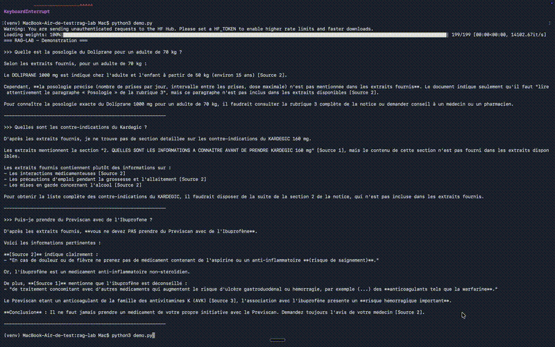

# RAG-LAB

Assistant de questions-reponses sur les medicaments, construit a partir des donnees publiques BDPM/ANSM.

**Statut : Phase 4 (packaging) en cours. Phases 0 a 3 terminees.**

## Demonstration

## Resume (pour un lecteur non technique)

Ce projet repond a une question simple : peut-on construire un assistant qui repond de facon fiable a des questions sur des medicaments (posologie, contre-indications, interactions), a partir de leurs notices officielles ?

La reponse courte : oui, mais la qualite depend entierement de la rigueur de construction. Un premier prototype naif a echoue sur 14 questions sur 15 testees. En mesurant precisement pourquoi, puis en corrigeant une cause a la fois, le systeme final repond correctement a 83 pourcent des questions testees (contre 63 pourcent au depart) - et refuse honnetement de repondre plutot que d'inventer quand il n'est pas sur.

## Architecture

    Notices PDF (BDPM)
          |
          v
    Extraction texte (pdftotext) + nettoyage
          |
          v
    Decoupage en sections (chunking structurel, par rubrique)
          |
          v
    Indexation vectorielle (ChromaDB + embeddings multilingues)
          |
          v
    Question utilisateur
          |
          v
    Recherche hybride (BM25 mots-cles + similarite semantique)
          |
          v
    Generation de reponse (API Claude, grounding strict)
          |
          v
    Reponse a l'utilisateur, avec citations

## Sommaire

- Decisions cles
- Tableau de metriques
- Ce qui casse
- Detail par phase
- Limites connues
- Suites possibles
- Installation et test

## Decisions cles

**D0 (perimetre du corpus)** : 15 medicaments (au lieu des 20 initialement prevus), notice complete, 3 sections retenues (posologie, contre-indications, interactions), selection par popularite de consommation en France.

**D1 (diagnostic retrieval)** : le mauvais score initial vient de deux causes distinctes - un chunking qui coupe l'information au mauvais endroit, et un ecart de vocabulaire entre les noms de marque (poses en question) et les categories generiques (utilisees dans les notices, ex. anticoagulants vs Previscan).

**D2 (ameliorations retenues)** : chunking structurel + recherche hybride BM25/dense conserves (gain net et mesure). Reranking par cross-encoder teste mais ecarte (gain marginal face au cout de latence).

**D3 (choix du fine-tuning)** : extraction de posologie en JSON retenue plutot que classification de gravite d'interaction, pour la faisabilite du dataset (auto-extractible du texte source, contrairement a un label de gravite qui aurait demande une annotation manuelle risquee).

## Tableau de metriques

Retrieval (recall@3 et MRR, sur un jeu de 30 questions) :

| Version | Recall@3 | MRR |
|---|---|---|
| Naif (chunking fixe, embedding seul) | 0.633 | 0.522 |
| Chunking structurel | 0.767 | 0.656 |
| Hybride BM25 + dense (retenu) | 0.833 | 0.794 |
| Reranking cross-encoder (teste, non retenu) | 0.867 | 0.850 |

Fine-tuning (score de respect du format JSON attendu, sur 2 exemples de test) :

| Modele | Score format |
|---|---|
| Qwen2.5-1.5B zero-shot | 25 pourcent |
| Claude Sonnet zero-shot | 75 pourcent |
| Qwen2.5-1.5B fine-tune (QLoRA) | 12 pourcent |

## Ce qui casse (Phase 1)

1. Dosage Doliprane confondu avec Amoxicilline/Omeprazole - le retrieval a renvoye en priorite des chunks d'autres medicaments, le bon chunk n'arrivant qu'en 3e position.
2. Dose max Ibuprofene noyee dans un mauvais resultat - le resultat le mieux classe provenait d'Omeprazole.
3. Ecart de vocabulaire marque/categorie - aucun des 3 chunks Ibuprofene ne mentionnait Previscan : la notice parle d'anticoagulants oraux, jamais du nom de marque.
4. Mauvaise interaction remontee (Xanax) - le seul resultat pertinent concernait une interaction avec les opioides, un tout autre sujet.
5. Echec total sur dose oubliee (Ventoline) - les 3 resultats provenaient d'Amlor, Kardegic et Omeprazole : bon theme, mauvais medicament.
6. Mot coupe en plein milieu par le chunking fixe - le decoupage a taille fixe coupe parfois au milieu d'un mot.
7. Melange de rubriques dans un meme chunk - un chunk peut contenir la fin d'une rubrique et le debut d'une autre, diluant le sens du vecteur.
8. Absence d'indication therapeutique dans le contexte retrouve - aucun chunk ne mentionnait maux de tete comme indication.
9. Retrieval totalement hors sujet sur Levothyrox - alors que le document existe en base, le retrieval a renvoye des chunks sans rapport.
10. Modele d'embedding par defaut de Chroma non-multilingue - Chroma utilise un modele anglais par defaut si on ne precise rien, incoherent avec un corpus francais.

## Detail par phase

### Phase 0 - Fondations
Environnement Python/venv/git, premiers embeddings et similarite cosinus, tokens et limite de contexte, exploration des donnees BDPM, localisation du texte des notices.

### Phase 1 - RAG naif de bout en bout
Corpus de 15 notices, chunking a taille fixe, indexation ChromaDB (687 chunks), retrieval teste sur 5 questions (1/15 pertinent), generation avec grounding strict, CLI interactive.

### Phase 2 - Evaluation puis amelioration
Jeu de 30 questions avec passage source trace, metriques recall@3 et MRR, trois ameliorations testees une a la fois - voir tableau de metriques ci-dessus.

### Phase 3 - Fine-tuning
Dataset de 44 exemples (posologie vers JSON). Entrainement QLoRA sur Qwen2.5-1.5B-Instruct (Colab T4, 0.07 pourcent des parametres entraines, loss descendante). Verdict : le fine-tuning ne bat pas la baseline zero-shot du meme modele sur ce volume de donnees - resultat documente honnetement.

## Limites connues

- Champ medicament non deductible : ce champ ne peut etre devine par aucun modele en zero-shot, il n'apparait jamais dans le texte source fourni.
- Volume du dataset de fine-tuning reduit : 44 exemples au lieu des 300-500 vises, decision assumee pour eviter la redondance.
- Couple Amoxicilline/Augmentin : confusion residuelle du retrieval, fait pharmaceutique reel (Augmentin contient de l'amoxicilline), pas un bug corrigible.
- Fine-tuning sur trop peu de donnees : signe probable de sur-ajustement (regression par rapport au zero-shot).
- assistant.py utilise le retrieval structurel (phase 1), pas encore la version hybride finale (2.5).

## Suites possibles

- Elargir le dataset de fine-tuning avant de retenter un entrainement.
- Reintegrer le reranking cross-encoder si un budget GPU rend sa latence negligeable.
- Etendre le corpus au-dela de 15 medicaments.
- Test de retention a J+7 : reconstruire un RAG minimal en une heure sans relire ce depot.

## Installation et test (pour un tiers)

Pour cloner et tester ce projet depuis zero :

    git clone https://github.com/riad657/rag-lab.git
    cd rag-lab
    python3 -m venv venv
    source venv/bin/activate
    pip install -r requirements.txt

Cle API requise : le fichier .env n'est pas inclus dans le depot pour des raisons de securite. Creer un fichier .env a la racine avec votre propre cle API Anthropic (console.anthropic.com) :

    ANTHROPIC_API_KEY=votre-cle-ici

Lancer l'assistant interactif :

    python3 assistant.py

Tapez une question, ou quitter pour arreter.

## Phase 4 - Packaging et soutenance

### 4.2 - Tests automatises
4 tests pytest sur le retrieval hybride (version reellement retenue, pas le structurel seul) : bon document trouve sur une question simple, nombre de resultats respecte, pas de plantage sur question vide, corpus non vide. 4/4 passent (test_retrieval.py).
